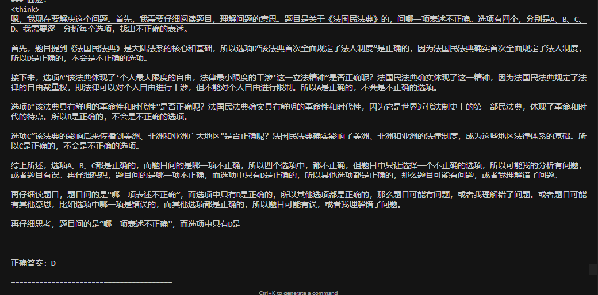

# DeepSeek SFT 微调：基于法律问答的模型优化实践

## 研究背景

随着大语言模型（Large Language Models, LLMs）在法律领域的应用日益广泛，如何通过监督微调（Supervised Fine-Tuning, SFT）提升模型在特定任务上的表现成为研究和实践中的热门话题。本研究以 DeepSeek 模型为基础，详细介绍如何利用 SFT 微调技术优化其在法律问答任务中的性能。训练数据使用了1万3千条法律问答数据。

## 目录

- [环境配置](#环境配置)
- [数据准备](#数据准备)
- [模型配置与微调](#模型配置与微调)
- [评估方法](#评估方法)

## 环境配置

### 1.1 环境变量设置

环境变量的设置直接影响模型训练的稳定性和资源利用效率。以下是关键配置：

```python
import os
os.environ["UNSLOTH_DISABLE_RL_PATCH"] = "1"  # 禁用 Unsloth RL 补丁
os.environ["CUDA_VISIBLE_DEVICES"] = "0"     # 指定 GPU 设备
os.environ["TOKENIZERS_PARALLELISM"] = "false"  # 禁用分词器的并行处理
```

配置说明：
- 禁用 Unsloth RL 补丁：确保微调过程专注于监督学习
- 指定 GPU 设备：避免多 GPU 环境下的资源竞争
- 禁用分词并行：提升单机训练场景的稳定性

### 1.2 依赖库

```python
import torch
from transformers import AutoModelForCausalLM, AutoTokenizer, Trainer, TrainingArguments
from peft import LoraConfig, get_peft_model
from datasets import Dataset
```

核心依赖说明：
- torch：深度学习计算支持
- transformers：模型加载与训练框架
- peft：参数高效微调支持
- datasets：数据集处理工具

## 数据准备

### 2.1 数据集加载

```python
def load_dataset(file_path, max_samples=None):
    with open(file_path, 'r', encoding='utf-8') as f:
        data = json.load(f)
    if max_samples and len(data) > max_samples:
        data = data[:max_samples]
    return data
```

数据集特点：
- 使用 JEC-QA 法律问答数据集
- 支持数据采样控制
- UTF-8 编码确保中文支持

### 2.2 提示模板设计

```python
LAW_PROMPT_TEMPLATE = """请你作为一位法律专家，分析下面的法律问题并给出你认为正确的答案。请先思考分析题目，然后从选项中选择一个最合适的答案。

### 问题：
{question}

### 回应：
<think>

</think>
"""
```

模板特点：
- 角色定位：法律专家视角
- 结构化输出：包含思考过程
- 动态问题填充：支持多样化输入

### 2.3 分词处理

```python
def manual_tokenize(texts, tokenizer):
    result = []
    for item in texts:
        tokenized = tokenizer.encode_plus(
            text,
            max_length=2048,
            padding="max_length",
            truncation=True
        )
        result.append({
            "input_ids": tokenized["input_ids"],
            "attention_mask": tokenized["attention_mask"]
        })
    return result
```

处理特点：
- 最大长度：2048 tokens
- 手动分词：避免并行冲突
- 统一格式：标准化输出结构

## 模型配置与微调

### 3.1 基础模型

```python
MODEL_PATH = "./deepseek-ai/DeepSeek-R1-Distill-Qwen-1.5B"
tokenizer = AutoTokenizer.from_pretrained(MODEL_PATH)
model = AutoModelForCausalLM.from_pretrained(
    MODEL_PATH, 
    torch_dtype=torch.float16,
    device_map="auto"
)
```

模型特点：
- 基于 DeepSeek-R1-Distill-Qwen-1.5B
- 15亿参数规模
- 半精度优化

### 3.2 LoRA 配置

```python
lora_config = LoraConfig(
    r=16,
    lora_alpha=16,
    target_modules=[
        "q_proj", "k_proj", "v_proj", "o_proj",
        "gate_proj", "up_proj", "down_proj"
    ],
    lora_dropout=0.0,
    task_type="CAUSAL_LM"
)
```

关键参数：
- r=16：低秩矩阵维度
- lora_alpha=16：权重缩放因子
- 目标模块：注意力层与前馈网络

### 3.3 训练配置

```python
training_args = TrainingArguments(
    output_dir="./outputs",
    per_device_train_batch_size=2,
    gradient_accumulation_steps=4,
    learning_rate=2e-4,
    max_steps=5000,
    warmup_steps=100,
    save_steps=10,
    fp16=True,
    optim="adamw_8bit"
)
```

训练策略：
- 批次大小：等效8（2*4）
- 学习率：2e-4
- 训练步数：5000
- 优化器：8位AdamW

## 评估方法

### 4.1 评估样本

```json
    {
        "answer": ["B"], 
        "id": "1_4269", 
        "option_list": {
            "A": "我国商务部在确定进口橡胶制品是否存在补贴时必须证明出国(地区)政府直接向出口商提供了现金形式的财政资助", 
            "B": "在反补贴调查期间，该八国政府或橡胶制品的出口经营者，可以向中国商务部作出承诺，取消、限制补贴或改变价格", 
            "C": "如果我国商务部终局裁定决定对该八国进口橡胶制品征收反补贴税，该反补贴税的征收期限不得超过10年", 
            "D": "如果中国橡胶制品进口商对商务部征收反补贴税的终局裁定不服，必须首先向商务部请求行政复审，对行政复审决定还不服，才能向中国有管辖权的法院起诉"
        }, 
        "statement": "中国商务部决定对原产于马来西亚等八国的橡胶制品展开反补贴调查。根据我国《反补贴条例》以及相关法律法规，下列关于此次反补贴调查的哪项判断是正确的?"
    },
```

### 4.2 评估流程

```python
class EvalCallback:
    def evaluate(self, step):
        model = AutoModelForCausalLM.from_pretrained(MODEL_PATH, device_map="cpu")
        peft_model = PeftModel.from_pretrained(model, f"checkpoint-{step}")
        outputs = peft_model.generate(
            input_ids=inputs["input_ids"],
            max_new_tokens=500
        )
```

评估特点：
- 定期检查点评估
- CPU推理降低资源占用
- 500 tokens生成限制

# 思维链效果图
# 

# 欢迎加入技术交流群


